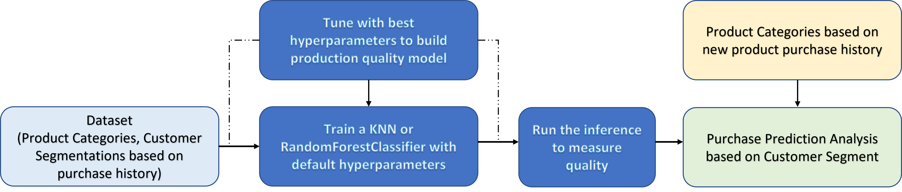
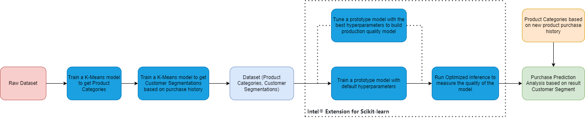
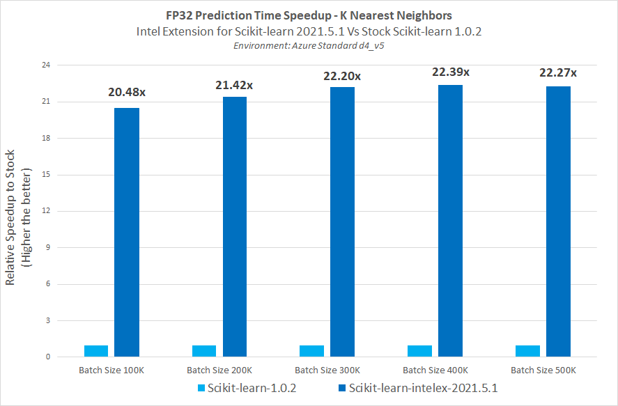

# **Scikit-Learn Purchase Prediction**
The Intel AI Analytics Toolkit (AI Kit) gives data scientists, AI developers, and researchers familiar Python tools and frameworks to accelerate end-to-end data science and analytics pipelines on Intel architectures. The components are built using oneAPI libraries for low-level compute optimizations. This toolkit maximizes performance from preprocessing through machine learning, and provides interoperability for efficient model development.
The Intel Extension for Scikit-learn is one of the libraries included in the AI Kit and it offers you a way to accelerate existing scikit-learn code. The acceleration is achieved through patching: replacing the stock scikit-learn algorithms with their optimized versions provided by the extension.

## **Table of Contents**
 - [Purpose](#purpose)
 - [Reference Solution](#reference-solution)
 - [Reference Implementation](#reference-implementation)
 - [Intel® Implementation](#optimizing-the-e2e-solution-with-intel-extension-for-scikit-learn)
 - [Performance Observations](#performance-observations)

## Purpose
Many retailers are trapped in the death spiral of never-ending sales designed to “buy” customers with deals. This vicious cycle of price slashing is not sustainable. Retail profit margins are razor thin as it is. More worryingly, as much as five percent of the their customer base typically is loss-making because these customers are so adept at using discounts, promotions and returning items. To overcome this issue, Machine learning is utilized to understand and optimize complex, multi-touch customer journeys, products and services. Core Customer-centric use cases should enable purchase prediction modeling.
Businesses should gain marketing insights on Customer behavioral profile enabling purchase prediction modeling. Purchase prediction based on the historic details of various customer purchases on different time frames would help the retail business to devise their operational and product marketing strategies based on real data.

In this reference kit, we demonstrate one way in which ML can aid in building a deeper understanding of a customer segments based on historical purchases, which can be further used to implement their operational and product marketing strategies.

## Reference Solution
One of the important aspect of purchase prediction for a new Customer is to map them to a segment of similar Customer purchase history. In this reference kit, we build a machine learning model based on the historic details of various customer purchases on different time frames to predict a customer belongs to certain segment. This would help the retail business to devise their operational and product marketing strategies based on real data when customer comes back on the channel next time. 

One of the primary methods for deriving an understanding of how we can accomplish this is by analyzing and exploring different AI based Machine Learning algorithms on various feature sets to categorize the customers to appropriate segments based on their historic purchases.

The reference kit explores ways to
- Faster model development that helps in building purchase prediction models 
- Performance efficient purchase prediction mechanisms

The Reference Solution intends to provide a reference approach to achieve several value metrics. Data Scientists can use, adapt or refer to this reference solution to build solutions in their industry and across the value chain.

## Key Implementation Details
Since the approach involves clustering of data in the initial analysis to create the product categories, unsupervised machine learning technique (K-Means) is used for the same. We also need to predict the Customer segment based on their purchase which is solved as a classification problem and this reference kit covers this part of the flow. The benchmarking is done only for the classifier models involved in predicting the customer segment with the features of known product categories from their product purchase history. For this, multiple below classifiers algorithms are analyzed 
- K-Nearest Neighbor Classifier
- Random Forest Classifier

The reference kit implementation is a reference solution to the target customer purchase prediction use case that includes 

  1. A reference E2E architecture to arrive at an AI solution with KNN and RandomForestClassifier from Scikit-learn.
  2. An Optimized reference E2E architecture enabled with Intel® Scikit-Learn Extension available as part of Intel AI Analytics Toolkit. 

## **Reference Implementation**

### ***E2E Architecture***
### **Use Case E2E flow**



### ***Hyper-parameter Analysis***
In realistic scenarios, an analyst will run the same machine learning algorithm multiple times on the same dataset, scanning across different hyper-parameters.  To capture this, we measure the total amount of time it takes to generate results across a grid of hyper-parameters for a fixed algorithm, which we define as hyper-parameter analysis.  In practice, the results of each hyper-parameter analysis provides the analyst with many different customer segments and purchase predictions that they can take and further analyze.

The below table provide details about the hyperparameters & values used for hyperparameter tuning for each of the algorithms used in our benchmarking experiments:
| **Algorithm**                     | **Hyperparameters**
| :---                              | :---
| kNN                               | `space or parameters = np.arange(1, 50, 1) ,`<br> `cross validation generator = 5 ,` <br> `n_jobs=-1` <br>
| Random Forest Classifier          | `criterion = ['gini'] ,` <br> `'n_estimators' =[20, 40, 60, 80, 100],` <br> `'max_features' = ['sqrt', 'log2']` <br>

###***Setting up (Software requirements)***
Note that this reference kit implementation already provides the necessary scripts to setup the software requirements. 
To utilize these environment scripts, first install Anaconda/Miniconda by following the instructions at the following link

https://docs.conda.io/projects/conda/en/latest/user-guide/install/index.html
or
[Anaconda installation](https://docs.anaconda.com/anaconda/install/linux/)

1. Python
2. Scikit-learn

First clone the repository executing the below command.
```
git clone https://github.com/oneapi-src/purchase-prediction
```

### ***Dataset***
The reference kit uses data from https://archive-beta.ics.uci.edu/ml/datasets/online+retail 

> *Please see this data set's applicable license for terms and conditions. Intel does not own the rights to this data set and does not confer any rights to it.*

After downloading the dataset from the above site to the "data" folder located inside the cloned repository, execute the below commands in the shell command line. These commands 
convert the excel file to csv file.
```shell
wget https://archive.ics.uci.edu/ml/machine-learning-databases/00352/Online%20Retail.xlsx
pip install xlsx2csv
xlsx2csv Online\ Retail.xlsx data.csv
```
Each record in the dataset represents purchase details of the product made by a customer with below features.

-    InvoiceNo: Purchase Invoice Number
-    StockCode: Product Stock Code
-    Description: Product Description
-    Quantity: Purchased Quantity
-    InvoiceDate: Purchase Date
-    UnitPrice: Unit price of the product
-    CustomerID: Unique Customer ID
-    Country: Country of the purchase

At first, the above features are used to create unique category of products from the product stock code and product description corpus. Once the product categories are identified, every invoice purchase is re-arranged to include the category of the products bought. Based on the categories of the product the customer segmentation is created. Based on these categorical features (Product Category and customer segmentation) multiple classification models are developed that allows to predict the purchases, based on the segment on which the customer is expected to be, that will be made by a new customer, during their next visit. This will allow retailers to provide offers only for the predicted purchase.

### ***Solution setup***
The below commands can be used to automate the creation of a conda environment for execution of the algorithms.

>Note: It is assumed that the present **working directory is the root directory of this code repository**

```sh
conda env create --file env/stock/customersegmentation_stock.yml
```

This command utilizes the dependencies found in the `env/stock/customersegmentation_stock.yml` file to create an environment as follows:

**YAML file**                                 | **Environment Name** |  **Configuration** |
| :---: | :---: | :---: |
| `env/stock/customersegmentation_stock.yml`             | `customersegmentation_stock` | Python=3.9.7 with stock Sci-kit Learn

For the workload implementation to arrive at first level solution we will be using the stock environment

Use the following command to activate the environment that was created:
```sh
conda activate customersegmentation_stock
```

## Reference Sources
**Case Study Reference**: https://www.kaggle.com/code/fabiendaniel/customer-segmentation/

### ***Solution implementation***

#### **Model building process**
As mentioned above this hyperpersonalized target recommendation uses KNN and RandomForestClassifier from scikit learn library to train  a AI model and generate labels for the passed in data.  This process is captured within the `purchase-prediction-module.py` script. This script *reads and preprocesses the data*, and *performs hyperparameter analysis on either KNN or RandomForestClassifier*, while also reporting on the execution time for preprocessing and hyperparameter analysis steps(we will use this information later when we are optimizing the implementation for Intel® architecture).  Furthermore, this script can also save each of the intermediate models for an in-depth analysis of the quality of fit.  

This script mainly performs two objectives - Data preparation & Benchmarking of stock Libraries versus the Intel oneAPI Libraries.

Data preparation step is performed first. It involves the following steps:
1. Removal of null values in the raw data
2. Analyse the Description cloumn by listing all the keywords & figuring out the most frequent occurring keywords
3. Defining the product categories
4. Using one hot encoding to create group of products
5. Creation of customer categories

The script takes the following arguments:
```sh
usage: purchase-prediction-module.py [-h] [-rtd RAW_TRAIN_DATA] [-daf DATA_AUG_FACTOR] [-ftd FINAL_TRAIN_DATA] [-t TUNING] [-s STOCK] [-alg ALGORITHM]

optional arguments:
  -h, --help            show this help message and exit
  -rtd RAW_TRAIN_DATA, --raw-train-data RAW_TRAIN_DATA
                        raw data csv file, if this parameter is specified then it will only perform the data preparation part
  -daf DATA_AUG_FACTOR, --data-aug-factor DATA_AUG_FACTOR
                        data augmentation/multiplication factor, requires --raw-train-data parameter
  -ftd FINAL_TRAIN_DATA, --final-train-data FINAL_TRAIN_DATA
                        final filtered data csv file, if this parameter is specified then it will skip the data preparation part
  -t TUNING, --tuning TUNING
                        hyper parameter tuning (0/1)
  -s STOCK, --stock STOCK
                        Use Stock Python (0/1)
  -alg ALGORITHM, --algorithm ALGORITHM
                        scikit learn classifier algorithm to be used (knn,rfc) - knn=KNearestNeighborClassifier, rfc=RandomForestClassifier
  -inf INFERENCE, --inference INFERENCE
                        Performs Inference on the saved models for batch data. Specify the model files i.e knn_model or rfc_model for knn=KNearestNeighborClassifier, 
                        rfc=RandomForestClassifier  respectively .
```

**Data preparation**
Below command can be used to generate different dataset sizes which can be later used for feeding to the scikit-learn algorithms for benchmarking. 
```sh
python ./src/purchase-prediction-module.py -rtd data/data.csv -daf 20
```
The above example generates `data/data_aug_20.csv` dataset which is the 20 fold multiplication of the initial filtered data.

**Training**
Use the below command to run the training with the generated data for best hyperparameter training mode for the algorithm K-NN Classifier in stock environment.Use `-s 1` option for stock conda environment.

```sh
python ./src/purchase-prediction-module.py -ftd data/data_aug_20.csv -t 0 -s 1 -alg knn
```
This will save the trained model in the path ./model. i.e. knn_model.joblib will be saved in the path ./model.
Similarly, we need to run for other two algorithms. 

**Expected Output**
Below output would be generated by the training module which will capture the best tuned hyperparameter training time.
```
INFO:__main__:Running KNeighborsClassifier ...
INFO:__main__:====> KNeighborsClassifier Training Time 0.007310628890991211 secs
INFO:__main__:====> Program execution time 0.19111275672912598 secs
```

**Hyperparameter tuning**
In case of hyperparamter tuning mode training, use `-t 1` option. Gridsearch CV process is used for Hyperparameter tuning.
```sh
python ./src/purchase-prediction-module.py -ftd data/data_aug_20.csv -t 1 -s 1 -alg knn
```
> Note: The tuned models will be saved as part of hyperparameter tuning.

**Inference / Prediction**
Use the hyperparameter tuning script to generate the model with full dataset size and save it. Once the model is saved, we need to use them for inferencing. 
When the current source code is ran, Batch inference is performed. The saved model is loaded & fed with a batchdata & the prediction output
 is obtained. The entire dataset file passed will be used as batchsize for inference. We need pass the model name as a parameter in the console as 
 shown below for KNearestNeighborClassifier model. 

**Note:** The inference or prediction is done only for KNN classifier model.

```sh
python ./src/purchase-prediction-module.py -ftd data/data_aug_20.csv -s 1 -inf knn_model
```
| **Algorithm**               | **Model Name to be passed**           
| :---                        | :---                            
| KNearestNeighborClassifier  | knn_model                         

**Expected Output**
Below output would be generated by the module which will capture the hyperparameter tuned inference time and accuracy.
```
kNN model loaded successfully
====> KNeighborsClassifier Model Inference Time is 0.20563340187072754 secs
====> Accuracy for kNN is: 100.0 % 
====> F1 score for kNN is: 1.0
====> Program execution time 1.6182811260223389 secs
```

## **Optimizing the E2E solution with Intel Extension for Scikit-learn**
Although AI delivers a solution to address customer purchase prediction, on a production scale implementation with millions or billions of records demands for more compute power without leaving any performance on the table. Under this scenario, a business analyst aims to do a deep exploratory dive into their customer purchase data to find better opportunities.  In order to derive the most insightful and beneficial actions to take, they will need to study and analyze the segments generated through various feature sets and algorithms, thus requiring frequent re-runs of the algorithms under many different parameter sets. To utilize all the hardware resources efficiently, Software optimizations cannot be ignored.   
 
This reference kit solution extends to demonstrate the advantages of using the Intel AI Analytics Toolkit on the task of building a targeted understanding of customer characteristics from purchase data.  The savings gained from using the Intel Extension for Scikit-learn can lead an analyst to more efficiently explore and understand customer archetypes, leading to better and more precise targeted solutions.

#### Use Case E2E flow


### **Optimized software components**

#### ***Intel Extension for Scikit-learn***
Designed for data scientists, Intel Extension for Scikit-Learn is a seamless way to speed up your Scikit-learn applications for machine learning to solve real-world problems. This extension package dynamically patches Scikit-learn estimators to use Intel oneAPI Data Analytics Library (oneDAL) as the underlying solver, while achieving the speed up for your machine learning algorithms.

### ***Optimized Solution setup***
The below commands can be used to automate the creation of a conda environment for execution of the algorithms.

>Note: It is assumed that the present working directory is the root directory of this code repository

```sh
conda env create --file env/intel/customersegmentation_intel.yml
```

This command utilizes the dependencies found in the `env/intel/customersegmentation_intel.yml` file to create an environment as follows:

**YAML file**                                 | **Environment Name** |  **Configuration** |
| :---: | :---: | :---: |
| `env/intel/customersegmentation_intel.yml`             |      `customersegmentation_intel` |     Python=3.9.7 with Intel® Sci-kit Learn Extension (2021.5.1)

For the workload implementation to arrive at first level solution we will be using the intel environment

Use the following command to activate the environment that was created:
```sh
conda activate customersegmentation_intel
```

### ***Optimized Solution implementation***
Optimizing the KNN and RandomForestClassifier solution with Intel Extension for Scikit-learn is as simple as adding the following lines of code prior to calling the sklearn algorithms:

```python
from sklearnex import patch_sklearn
patch_sklearn()
```

#### **Model building process with Intel® optimizations**

All of the benchmarking can be run using the python scripts `src/purchase-prediction-module.py`.

Data preparation once performed, need not be performed again unless one wants to generated more or less filtered data i.e. with different augmentation factors.

**Training**
Use the below command to run the training with the generated data for best tuned hyperparameters training mode for the algorithm KneighborClassifier 
in intel environment. Use `-s 0` option for intel conda environment.

```sh
python ./src/purchase-prediction-module.py -ftd data/data_aug_20.csv -t 0 -s 0 -alg knn
```

**Expected Output**
Below sample output would be generated by the training module which will capture the overall training time.
```
INFO:__main__:Running KNeighborsClassifier ...
INFO:__main__:====>KNeighborsClassifier Average Training Time with best tuned hyper parameters 0.007310628890991211 secs
INFO:__main__:====> Program execution time 0.19111275672912598 secs
```


**Hyperparameter tuning**
In case of hyperparameter tuning mode training, use `-t 1` option. Gridsearch CV process is used for Hyperparameter tuning.
```sh
python ./src/purchase-prediction-module.py -ftd data/data_aug_20.csv -t 1 -s 0 -alg knn
```

**Expected Output**
Below output would be generated by the training module which will capture the hyperparameter tuning training time . This will save the trained model in 
the path /model. i.e. knn_model.joblib will be saved in the path /model. Simlarly we need to run for another rfc algorithm. 
```
INFO:__main__:====> KNeighborsClassifier Training Time with hyperparameters 67.140428619385 secs
INFO:__main__:Saving the model ...
INFO:__main__:KNeighborsClassifier model 'knn_model.joblib' is saved in: /model
INFO:__main__:====> Program execution time 68.47586631774902 secs
```
> Note: The tuned models will be saved as part of hyperparameter tuning.

**Inference / Prediction**
Once the models are saved, we need to use them for inferencing. When the current source code is ran, Batch inference is performed. The saved model is 
loaded & fed with a batchdata & the prediction output is obtained. The entire dataset file is passed to function for inference.
We need pass the model name as a paramter in the console as shown below for KNearestNeighborClassifier model

```sh
python ./src/purchase-prediction-module.py -ftd data/data_aug_20.csv -s 0 -inf knn_model
```

**Note:** Inference benchmarking done only for KNN model.

## **Performance Observations**
This section covers the comparison of best tuned hyperparameter training time & inference time comparison between Stock scikit-learn python package 
and Intel scikit-learn extension python package distribution for the model building and tuning. The CPU instance used for benchmarking is D4_V5.


Intel® Extension for Scikit-learn-2021.5.1 offers training time speed-up upto <b>1.56x</b> compared to Scikit-learn-1.0.2 with k Nearest Neighbor model 
for training models.



Intel® Extension for Scikit-learn 2021.5.1 offers prediction time speed-up ranging between <b>20.48x</b> and <b>22.42x</b> compared to 
stock Scikit-learn 1.0.2 with k Nearest Neighbor models.

## Notices & Disclaimers
Performance varies by use, configuration and other factors. Learn more on the [Performance Index site](https://edc.intel.com/content/www/us/en/products/performance/benchmarks/overview/).<br>
Performance results are based on testing as of dates shown in configurations and may not reflect all publicly available updates.  See backup for configuration details.  No product or component can be absolutely secure. <br>
Your costs and results may vary. <br>
Intel technologies may require enabled hardware, software or service activation.<br>
© Intel Corporation.  Intel, the Intel logo, and other Intel marks are trademarks of Intel Corporation or its subsidiaries.  Other names and brands may be claimed as the property of others.  <br>

To the extent that any public or non-Intel datasets or models are referenced by or accessed using tools or code on this site those datasets or models are provided by the third party indicated as the content source. Intel does not create the content and does not warrant its accuracy or quality. By accessing the public content, or using materials trained on or with such content, you agree to the terms associated with that content and that your use complies with the applicable license.
 
Intel expressly disclaims the accuracy, adequacy, or completeness of any such public content, and is not liable for any errors, omissions, or defects in the content, or for any reliance on the content. Intel is not liable for any liability or damages relating to your use of public content.


## Conclusion
To build a customer segmentation solution at scale, Data Scientists will need to train models for substantial datasets and run inference more frequently.The ability to accelerate training will allow them to train more frequently and achieve better accuracy. Besides training, faster speed in inference will allow them to run prediction in real-time scenarios as well as more frequently. A Data Scientist will also look at data classification to tag and categorize data so that it can be better understood and analyzed. This task requires a lot of training and retraining, making the job tedious. The ability to get it faster speed will accelerate the ML pipeline. This reference kit implementation provides performance-optimized guide around customer purchase prediction use cases that can be easily scaled across similar use cases.

### Notes
***Please see this data set's applicable license for terms and conditions. Intel® does not own the rights to this data set and does not confer any rights to it.***


## Appendix

### **Experiment setup**
- Testing performed on: October 2022
- Testing performed by: Intel Corporation
- Configuration Details: Azure D4v5 (Intel® Xeon® Platinum 8370C CPU @ 2.80GHz), 1 Socket, 2 Cores per Socket, 2 Threads per Core, Turbo:On, Total Memory: 16 GB, OS: Ubuntu 20.04, Kernel: Linux 5.13.0-1031-azure, Software: Scikit-Learn* v1.0.2, Intel® Extension for Scikit-Learn* v2021.5.1


| **Optimized for**:                | **Description**
| :---                              | :---
| Platform                          | Azure Standard D4v5 : Intel® Xeon Platinum 8370C (Ice Lake) @ 2.80GHz, 4 vCPU, 16GB memory
| Hardware                          | CPU
| Operating System                  | Ubuntu 20.04
| Software                          | Intel® oneAPI AI Analytics Toolkit, Scikit-learn, pandas
| What you will learn               | Improving the performance of your ML workflow with the Intel Extension for Scikit-learn
